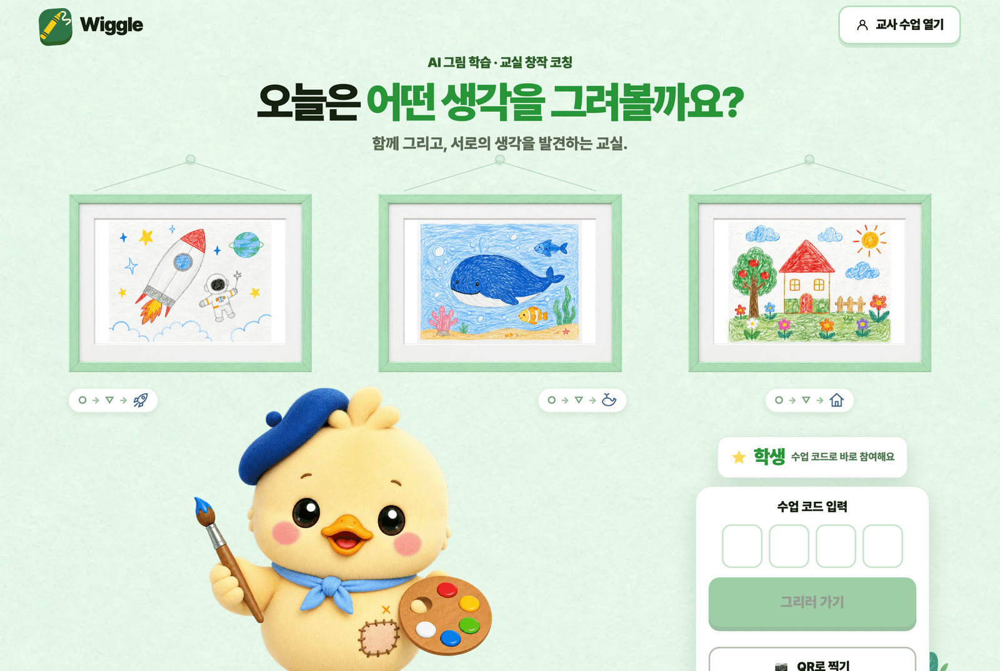
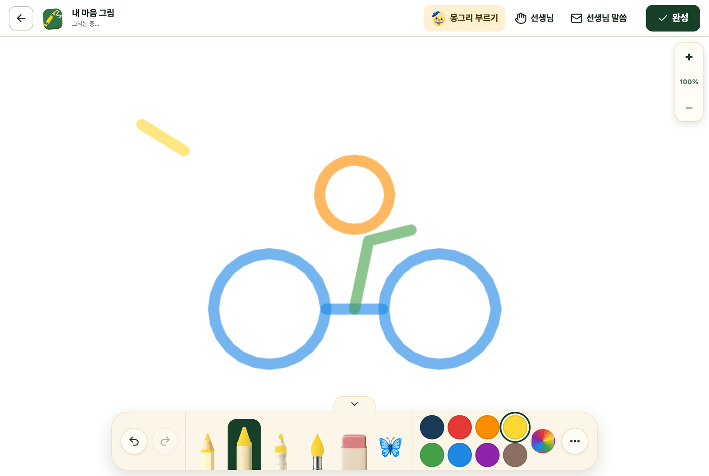
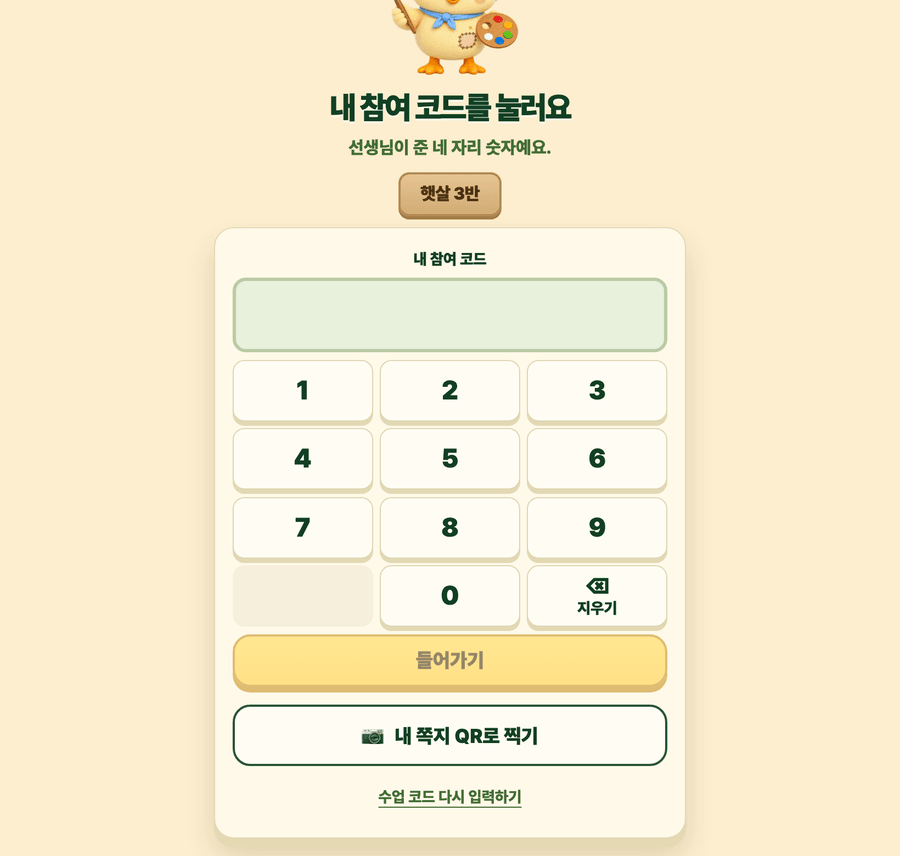

<p align="center">
  
</p>

<h1 align="center">Wiggle · 꿈틀</h1>

<p align="center">
  <strong>아이가 그리고, AI는 묻습니다.</strong><br />
  초등 교실을 위한 그림 창작 코칭 웹앱
</p>

<p align="center">
  <a href="https://www.kkumtle.app"><strong>서비스 열기</strong></a>
  ·
  <a href="#왜-wiggle인가">왜 Wiggle인가</a>
  ·
  <a href="#ai가-맡는-두-역할">AI가 맡는 두 역할</a>
  ·
  <a href="#아이가-얻는-것">아이가 얻는 것</a>
  ·
  <a href="#교실에서-이렇게-씁니다">교실에서 쓰는 법</a>
</p>

---

## 왜 Wiggle인가

**AI 시대에, 그림을 잘 그리는 손이 아이에게 얼마나 중요할까요?**

이미지 한 장은 몇 초면 만들어집니다. 잘 그린 선을 흉내 내는 일은 기계가 훨씬 잘합니다.
그래서 우리는 질문을 바꿨습니다.

> 그림을 **잘 그리는 것**이 중요할까요,
> 그림을 **보는 안목**과 자기 그림의 **세계를 넓히는 힘**이 중요할까요?

Wiggle은 두 번째를 고릅니다. 아이의 실력을 채점하지 않고, 아이가 **무엇을 보고 그렇게 그렸는지
스스로 말하게** 합니다. 그림은 결과물이 아니라 생각을 꺼내는 도구입니다.

교실에서 어려운 것은 늘 같습니다. 한 반에 스물몇 명인데, 아이마다 지금 필요한 질문이 다릅니다.
선생님 한 분이 모든 도화지 옆에 동시에 앉아 있을 수는 없습니다.
그 자리에 AI 친구 **몽그리**가 앉습니다. 대신 그려 주기 위해서가 아니라, **묻기 위해서**입니다.

## AI가 맡는 두 역할

몽그리는 그림을 대신 완성하지 않고, 잘 그렸는지 평가하지 않습니다.
아이 곁에서 맡는 역할은 딱 두 가지입니다.

### 1. 확장 협업자 — 그리는 중에

아이가 먼저 그리거나 말하면, 몽그리가 그것을 **받아서** 다음을 건넵니다. 순서가 중요합니다.
아이의 선과 말이 먼저이고 몽그리는 언제나 뒤를 따릅니다. 새 소재를 몽그리가 가져오지 않습니다.

> **아이** — 고양이가 자전거를 타요
> **몽그리** — 고양이가 어디로 가는 길일까? 가는 길에 무엇이 보일까?

한 번에 하나만 묻고, 모르면 추측하지 않고, 아이 그림에 없는 것을 있다고 말하지 않습니다.
아이가 부를 때 오는 것이 기본이고, 여덟 획 넘게 그린 뒤 한참 손이 멈췄을 때만 몽그리가
옆 패널로 조용히 먼저 말을 겁니다. **그리는 것을 막지 않는 것이 이 기능의 조건입니다.**
그림 한 장에 자동으로 말을 거는 건 최대 두 번, 아이가 다시 그리기 시작하면 스스로 접힙니다.

### 2. 틀리는 해석자 — 마무리할 때

완성을 누르면 몽그리가 **틀릴 수 있는 짐작**을 먼저 내놓습니다. 정답을 맞히려는 것이 아니라,
아이가 고쳐 주게 하려는 설계입니다.

> **몽그리** — 어? 난 이게 우산처럼 보이는데?
> **아이** — 아니야, 자전거 바퀴야. 여기 살이 있잖아

"무엇을 보고 그렇게 생각했니?"라고 물으면 자기 그림을 변호하라는 추궁이 됩니다.
반대로 어른이 먼저 틀리면, 아이는 신이 나서 **근거를 대며** 설명합니다.
그 한마디가 이 앱이 만들려는 학습의 핵심입니다.

두 역할 모두 같은 안전 규칙 안에서 움직입니다 — **대신 그리지 않기, 점수·순위·재능 진단 만들지 않기,
모르면 추측하지 않기, 한 번에 하나만 묻기.**

## 아이가 얻는 것

| | 무엇을 얻나 | 어떻게 |
| --- | --- | --- |
| 👀 | **보는 안목** | 자기 그림을 다시 보고, 무엇을 그렸는지 말로 옮깁니다 |
| 🗣️ | **근거를 대는 말** | 틀린 짐작을 고치면서 "왜 그렇게 보이는지"를 스스로 설명합니다 |
| 🌍 | **넓어지는 세계** | 한 장에서 끝나지 않고 장면이 이어져 이야기가 되고, 그림책 한 권이 됩니다 |
| ✋ | **주도권** | 몽그리는 제안만 합니다. 고르고 지우고 바꾸는 것은 언제나 아이입니다 |
| 🌱 | **자기 변화의 기록** | 획 하나하나가 과정으로 남아, 아이도 선생님도 "어떻게 자랐는지"를 봅니다 |

**우리가 하지 않는 것:** 점수, 순위, 재능 진단, 친구와의 비교, 아이 화면의 광고.
잘 그린 그림과 못 그린 그림을 가르지 않습니다.

## 교실에서 이렇게 씁니다

1. **선생님이 학급을 만듭니다.** 구글 계정으로 들어와 반 이름과 명단(번호·이름)을 넣으면,
   자리마다 네 자리 참여 코드가 만들어집니다. 코드표는 그대로 인쇄해 잘라 나눠 줍니다.
2. **아이는 두 번의 터치로 들어옵니다.** 전자칠판의 학급 QR을 찍고, 자기 참여 코드 네 자리를 누릅니다.
   쪽지의 개인 QR을 찍으면 그마저 건너뜁니다. **아이는 이메일도 비밀번호도 만들지 않습니다.**
3. **그리고, 이야기하고, 남깁니다.** 아이는 도화지에서 그리고 몽그리와 이야기합니다.
   완성한 그림은 그림책으로 엮거나, 기한이 있는 링크로 가족에게 보낼 수 있습니다.

### 선생님 화면

- **오늘 수업** — 반 전체 도화지를 큰 썸네일로 한눈에 봅니다.
- **옆에서 보기** — 한 아이의 그림을 실시간으로 따라 봅니다. 아이 화면에는 "선생님이 보고 있어요"가 뜹니다.
- **표시해 주기** — 아이 그림 **위의 다른 층**에 동그라미·화살표와 짧은 글을 얹습니다.
  아이 원본에는 절대 합성되지 않고, 아이는 큰 버튼으로 "알겠어요 / 잘 모르겠어요"라고 답합니다.
- **손들기** — 아이가 화면에서 손을 들면 선생님 목록에 표시됩니다. 조용한 아이도 부를 수 있습니다.
- **메시지** — 반 전체나 한 아이에게 짧은 말을 보냅니다.

### 아이 화면

<table>
  <tr>
    <td width="64%" valign="top">
      
    </td>
    <td width="36%" valign="top">
      
    </td>
  </tr>
</table>

- 화면을 꽉 채우는 도화지, 아래에서 접었다 펴는 **크레용 상자 도구 막대**
- 연필·크레용·마커·수채붓·지우개, 1픽셀 단위로 조절하는 굵기, 좌우 대칭, 채우기·도형·글씨
- 두 손가락 확대와 자유로운 이동, 되돌리기·다시하기
- 손가락·스타일러스 모두 지원. 손바닥이 닿아도 그려지지 않는 펜 모드
- 설치가 필요 없습니다. 태블릿·크롬북·노트북의 브라우저면 됩니다.

## 무엇에 기대어 만들었나

교육학적 뼈대는 세 가지의 조합입니다. 미술사 지식이나 그림 실력이 목표가 아니라,
**아이가 스스로 관찰하고 근거를 대는 것**이 목표입니다.

- **See-Think-Wonder** (Harvard Project Zero) — 관찰·추론·질문을 끌어내는 발문 루틴
- **Studio Thinking**의 Reflect / Critique (Harvard Project Zero) — **아이 자기 작품**에 대한 구조화된 발문
- **Storyline Method** (1965) — 장면을 이어 하나의 이야기를 완성하는 구조

두 AI 역할도 검증된 연구에 기댑니다 — 확장 협업자는 StoryDrawer(CHI 2022, 만 6–10세 대상),
틀리는 해석자는 Weng et al. 2025(BMC Medical Education)입니다.
VTS(Visual Thinking Strategies)는 타인의 작품·집단 토론·인증 진행자를 전제하므로,
아이가 저자인 그림에 1:1로 쓰는 이 제품에서는 **VTS라고 표기하지 않습니다.**

## 아이 개인정보

- 학생은 **이메일도 계정도 만들지 않습니다.** 작품은 서버가 발급한 익명 ID에 저장됩니다.
- 실명은 **담임 선생님의 명단에만** 있습니다. 아이 화면·가족 공유·AI 요청에는 실려 나가지 않습니다.
- 수업 코드와 학급 QR은 **입장 수단일 뿐** 남의 작품을 볼 권한이 아닙니다.
- 가족 공유 링크는 기한이 있고 선생님이 언제든 끊을 수 있습니다.
- 점수·순위·재능 진단 데이터를 애초에 만들지 않습니다.

## 지금 상태

현장 검증을 진행 중인 교육용 서비스입니다. 초등 3~6학년을 핵심 사용자로 두고,
글을 덜 읽어도 그림과 큰 터치 목표만으로 핵심 행동이 되도록 만들고 있습니다.
휴대폰 세로(320×568)부터 태블릿·데스크톱까지 실제 브라우저로 회귀 검증합니다.

- 서비스 주소: **https://www.kkumtle.app**
- 진행 상황: [현재 상태](./docs/current-state.md) · [확정한 제품 결정](./docs/product-decisions.md) · [미결정 항목](./docs/pending-decisions.md)

## 개발자를 위한 짧은 안내

```bash
npm install
cp .env.example .env.local   # 값은 로컬 개발용만 채웁니다
npm run db:local:init        # 로컬 파일 DB(.data/wiggle-local.db)
npm run dev                  # http://localhost:3000
```

localhost에서는 구글 로그인 대신 이메일·PIN으로 여는 **로컬 교사 로그인**이 열립니다.

```bash
npm run typecheck && npm run lint && npm test
npm run build && npx next start -p 3299 &
node scripts/browser-check.mjs http://localhost:3299   # 실제 브라우저 회귀 검증
```

Next.js(App Router) · TypeScript · Turso(libSQL) · Cloudflare R2 · Vercel.
자세한 구조와 작업 규칙은 [CLAUDE.md](./CLAUDE.md)와 [docs/](./docs)에 있습니다.

## 라이선스

저장소에 별도 `LICENSE` 파일이 없습니다. 소스 사용·재배포·상업적 이용 권한은 저장소 소유자에게 확인해 주세요.

---

<p align="center">
  
</p>
